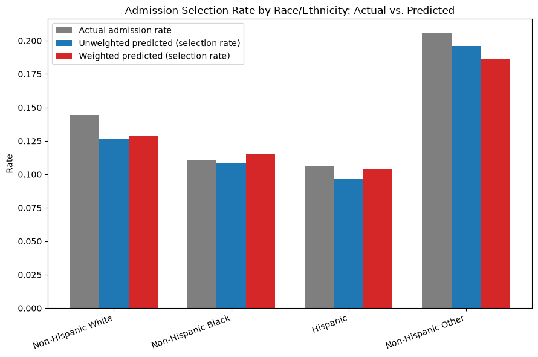

# Fairness Audit: Race/Ethnicity (RACERETH)

Generated: 2026-07-25T12:44:19.443504+00:00

Compares the survey-weighted and unweighted LightGBM models across race/ethnicity groups on the validation split. `RACERETH` is NHAMCS-imputed (no missing category): 1=Non-Hispanic White, 2=Non-Hispanic Black, 3=Hispanic, 4=Non-Hispanic Other (confirmed against the NCHS codebook).

## Per-Group Metrics

| Group | N | Actual Admit Rate | Unweighted Selection Rate | Weighted Selection Rate | Unweighted TPR | Weighted TPR | Unweighted ROC-AUC | Weighted ROC-AUC |
|---|---|---|---|---|---|---|---|---|
| Non-Hispanic White | 1310 | 0.1443 | 0.1267 | 0.1290 | 0.6825 | 0.6931 | 0.9636 | 0.9619 |
| Non-Hispanic Black | 598 | 0.1104 | 0.1087 | 0.1154 | 0.6818 | 0.7121 | 0.9510 | 0.9454 |
| Hispanic | 394 | 0.1066 | 0.0964 | 0.1041 | 0.7381 | 0.7619 | 0.9809 | 0.9796 |
| Non-Hispanic Other | 102 | 0.2059 | 0.1961 | 0.1863 | 0.8571 | 0.8095 | 0.9777 | 0.9818 |

## Disparity Summary (max-min gap across groups — smaller is more equitable)

| Metric | Unweighted Gap | Weighted Gap | Change |
|---|---|---|---|
| selection_rate | 0.0996 | 0.0822 | narrowed ✓ (-0.0174) |
| true_positive_rate | 0.1753 | 0.1164 | narrowed ✓ (-0.0589) |
| false_positive_rate | 0.0177 | 0.0167 | narrowed ✓ (-0.0010) |
| roc_auc | 0.0298 | 0.0364 | widened (+0.0065) |

## Interpretation

Survey weighting **narrows** both the selection-rate and true-positive-rate gaps across race/ethnicity groups on this validation split — consistent with the intended effect of survey weights (correcting for a sample that isn't perfectly representative of the U.S. population NHAMCS is designed to estimate) also producing a more equitable model, not just a differently-calibrated one. This should be read as suggestive, not conclusive: one validation split, one protected attribute, and no statistical significance testing on the gap differences themselves — a proper fairness study would bootstrap confidence intervals around each gap before drawing a firm conclusion.

One caveat worth flagging rather than hiding: the per-group **ROC-AUC gap widens slightly** under weighting (0.0298 → 0.0364). ROC-AUC measures ranking quality independent of the 0.5 threshold, while selection rate and TPR are both threshold-dependent. This means survey weighting is improving fairness *specifically at the operating threshold this project uses*, not uniformly across every possible threshold — a distinction worth keeping in mind if the decision threshold is ever revisited.