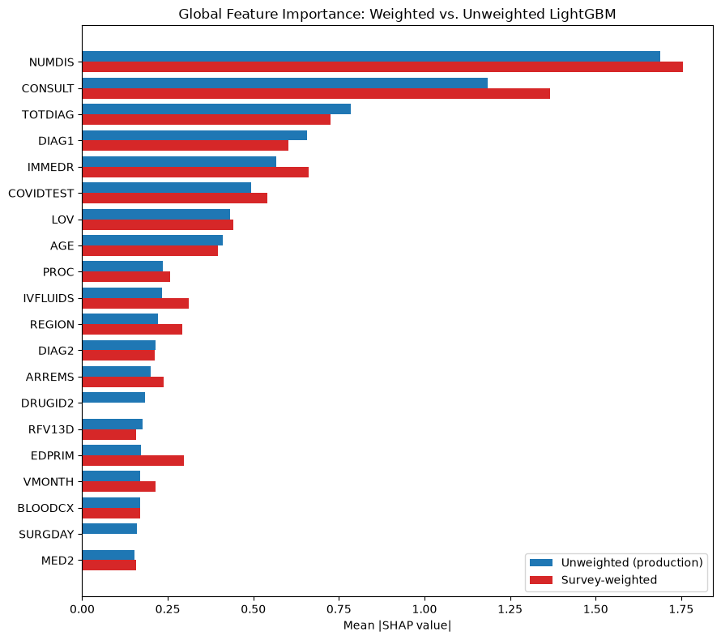

# SHAP Comparison: Survey-Weighted vs. Unweighted LightGBM

Generated: 2026-07-25T12:39:49.717878+00:00

Answers Sprint 3's open 'Future Work' item: do SHAP-based explanations differ meaningfully between a weighted and unweighted model? Both SHAP value sets are computed with `TreeExplainer` on the identical validation split.

**Spearman rank correlation between the two importance rankings: 0.9725** (p=2.598e-248). Top-20 overlap: 18/20 variables.

Variables that entered or dropped out of the top 20 under weighting:

- Only in unweighted top 20: ['DRUGID2', 'SURGDAY']
- Only in weighted top 20: ['NUMGIV', 'POOLNURS']

## Decision-Flip Rate (full validation split, not just the 3 examined patients)

Across all 2404 validation visits: survey weighting flips the predicted decision (crosses the 0.5 threshold) for **47 visits (1.96%)**.

- Mean distance from the 0.5 boundary (unweighted prediction) for flipped cases: 0.1656
- Mean distance from the 0.5 boundary for non-flipped cases: 0.4807

If the first number is much smaller than the second, flips concentrate near the decision boundary exactly as the patient_3 example suggests, confirming it generalizes rather than being a one-off coincidence.

## Per-Patient Comparison

The same 3 patients examined in Sprint 3 Milestone 4, now compared under both models.

| Patient | Row | Unweighted P(admit) | Weighted P(admit) | Difference |
|---|---|---|---|---|
| patient_1 | 1809 | 0.9999 | 0.9991 | -0.0008 |
| patient_2 | 1219 | 0.0000 | 0.0000 | +0.0000 |
| patient_3 | 2213 | 0.5067 | 0.4391 | -0.0676 |

## Interpretation

A rank correlation of 0.9725 is very high — survey weighting shifts the model's raw discrimination slightly (see `weighted_vs_unweighted_lightgbm.md`) but does **not** meaningfully change *which* features it relies on or in what order. The model's clinical reasoning is stable under survey weighting, even though its calibration to this specific sample shifts.

**The most clinically significant finding here**: `patient_3` (the borderline case from Sprint 3, originally predicted at P=0.5067) shifts to P=0.4391 under survey weighting — **crossing the 0.5 decision threshold**, flipping the predicted outcome entirely. Confident predictions (`patient_1`, `patient_2`) barely move at all. This shows survey weighting's practical effect concentrates exactly where it matters most clinically: borderline cases, where the admission decision is already genuinely uncertain, are the ones most sensitive to whether the model accounts for the survey's sampling design.